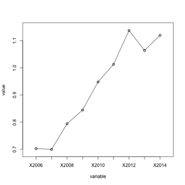
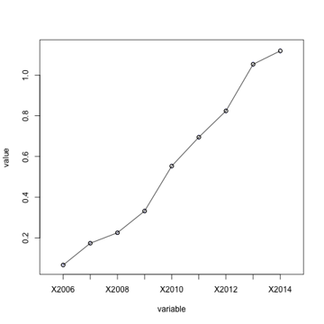

# techsoup-global
Repo for the TechSoup Global - NGO Source DataDive Project - March 2015

hackpad: http://bit.ly/SFdatadive_hackpad
slack domain: datakind-sf-bayarea

**NOTE: Please do NOT store data in this repo**

# TakeAways

## Business Insights

### Average transactions per year, US and non-US

### Average transactions per year broken down by org type, US and non-US

## Clustering

## Recommender
