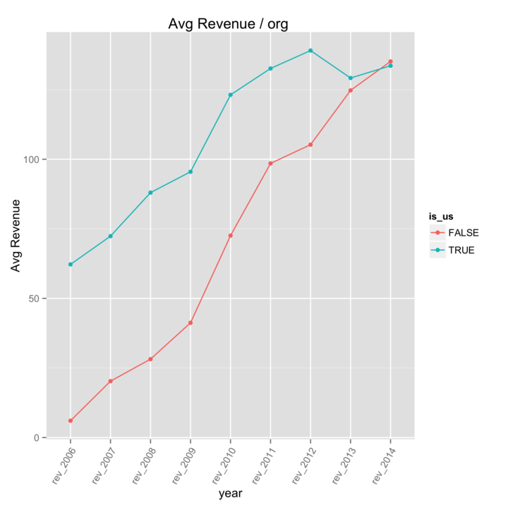
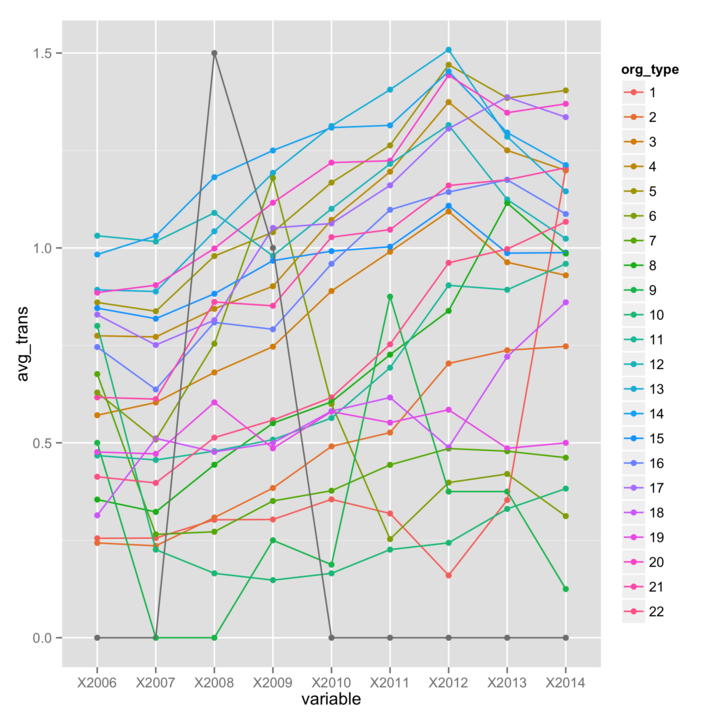
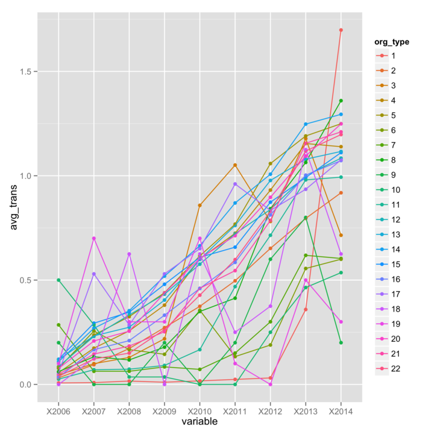
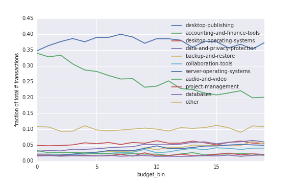

# TechSoup-Global

Repo for the TechSoup Global - NGO Source DataDive Project - March 2015

hackpad: http://bit.ly/SFdatadive_hackpad

**NOTE: Please do NOT store data in this repo**

# TakeAways

## Data Exploration and Categorical Trends

Data `descriptives` and `summary_plots` were created by [ericlwilliams](http://www.github.com/ericlwilliams). The following plots are examples of that exploration.

#### Average transactions per year, US and non-US

#### Average transactions per year broken down by org type, US and non-US

Businness insight R-exploration by [ganesh-krishnan](http://www.github.com/ganesh-krishnan) can be found in `businessIntel`.

## Clustering

Categorical binning and cluster analysis by [RemiLehe](http://www.github.com/RemiLehe) can be found in `clustering`. The following is an example.

#### Fraction of purchases by category vs budget

Large orgs buy less accounting and finance tools.
(budget is linearly binned from $0 to $1M.)

## Recommenders

#### Recommender A

Supervised learning approach to a recommendation system was explored by [jgaw](http://www.github.com/jgaw) and [dav1dfeldman](http://www.github.com/dav1dfeldman).

#### Recommender B

Recommender system explored in R by [CodyStumpo](http://www.github.com/CodyStumpo).

#### Recommender C

Recommender system explored by [semerj](http://www.github.com/semerj).
